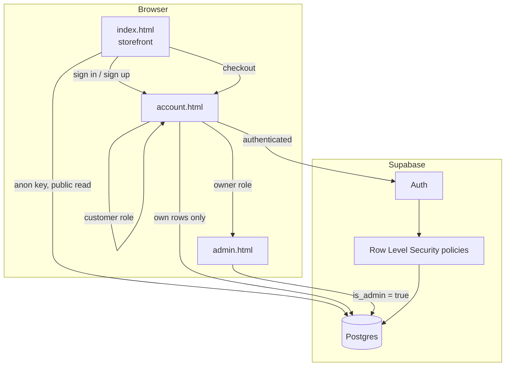
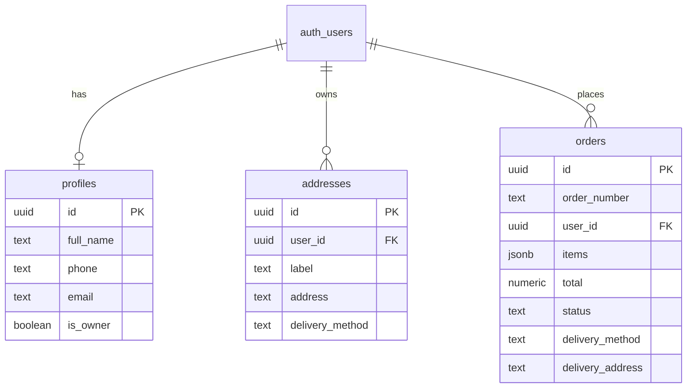

# DRIPSTARS.COM

A full-stack e-commerce site for a South African resale retailer selling iPhones, laptops, sneakers, and perfumes — built from scratch with vanilla JavaScript on the frontend and Supabase (Postgres + Auth) on the backend. No frontend framework, no build step — just HTML, CSS, and JS talking directly to a real database with proper access control.

**[Live demo →](#)** <!-- add your deployed URL here once hosted -->

---

## Why this project

This started as a real request from a small retail business owner and grew into a complete system: customer accounts with email verification, a multi-step checkout with saved delivery options, row-level-security-enforced data access, and a separate owner dashboard — all sharing one login system, one codebase, and one database.

The goal wasn't to reach for a framework by default. It's to show that the fundamentals — DOM manipulation, event delegation, state management, async/await, SQL, and access control — are solid enough to build a real product without one.

## Features

**Storefront**
- Product catalog across 4 categories with category/price/condition filtering, search with autocomplete, and sorting
- Color-variant selection per product — switching color updates a generated illustration live, or shows a real product photo if one exists (see [Product photos](#product-photos) below)
- Persistent cart (localStorage) that survives page reloads and login redirects
- Multi-step checkout: saved delivery options (Paxi / The Courier Guy / PostNet, each with a different required field), contact confirmation, and order submission — all gated behind a real account

**Accounts**
- Email + password signup with a 6-digit verification code (not a magic link) via Supabase Auth
- One shared login for both customers and the store owner — the owner is automatically routed to a separate dashboard after signing in, based on a role flag checked server-side
- Customer dashboard: editable profile, saved delivery options (multiple, labeled), and full order history

**Owner dashboard**
- Live order table with search, status filtering, and per-order detail view
- Order status workflow (Pending → Confirmed → Shipped → Completed/Cancelled)
- At-a-glance stats: total orders, today's orders, pending count, total revenue
- Protected by Postgres row-level security, not just a login screen — a regular customer account cannot read other customers' orders even if they guess the URL

**Order handoff**
- On confirmation, an order is saved to the database *and* a WhatsApp message opens with the order number and details pre-filled — payment stays a manual, direct conversation between customer and owner rather than collecting card data on-site

## Tech stack

| Layer | Choice | Why |
|---|---|---|
| Frontend | Vanilla HTML / CSS / JavaScript | No framework overhead for a site this size; demonstrates the fundamentals directly |
| Backend | [Supabase](https://supabase.com) (Postgres, Auth, Row Level Security) | Real relational database and auth without hand-rolling a server |
| Hosting target | Static host (Netlify/Vercel/GitHub Pages) | The frontend is fully static; Supabase is the only "backend" |
| Fonts | Fraunces, Inter, Dancing Script (Google Fonts) | — |

## Architecture



Three roughly-independent pages share the same Supabase project and the same visual design system:

- **`index.html` / `script.js`** — the public storefront. Works even for signed-out visitors (browsing, cart); checkout requires a session.
- **`account.html` / `account.js`** — the single login surface for everyone. Handles signup, email code verification, profile, saved delivery options, and order history. Redirects to the admin dashboard if the signed-in user is flagged as the owner.
- **`admin.html` / `admin.js`** — has no login form of its own. On load, it checks for a valid session and an `is_owner` flag on the user's profile; anyone else is redirected back to `account.html`. Access control lives in the database (RLS), not just this client-side check.

## Database design



Key design decisions:
- **`is_admin()` is a Postgres function**, not a client-side check — every RLS policy that needs to distinguish "owner" from "customer" calls this function server-side, so the distinction can't be spoofed from the browser.
- **Orders support both guest and account checkout** at the schema level (`user_id` is nullable) even though the current UI requires an account — the database was designed to not paint the product into a corner.
- **A Postgres trigger auto-creates a `profiles` row** whenever someone signs up via `auth.users`, so the app never has to remember to do it manually.

## Security notes (for anyone reviewing this)

- The Supabase key embedded in the frontend JS is the **public/anon key**, which is meant to be exposed — it identifies the project, not a secret credential. Actual access control is enforced by Postgres Row Level Security policies on the server, not by hiding the key.
- No payment information is collected or stored anywhere in this system. Bank details are exchanged directly between customer and owner over WhatsApp after an order is confirmed — deliberately, to avoid ever handling or displaying financial account details through the site itself.
- Email verification uses a 6-digit code rather than a magic link, entered directly in the UI, which avoids the security and UX pitfalls of email link handling across devices.

## Product photos

Products can display either a real photo or a generated color-tinted illustration, chosen automatically:

- Photos are looked up by convention: `images/<product-id>-<color-slug>.<ext>`
- The loader tries `.jpg`, `.jpeg`, `.png`, and `.webp` in order before falling back
- If no matching file exists, a CSS-generated illustration (shaped per category — phone, laptop, sneaker, perfume — and tinted to the selected color) is shown instead

This means the catalog is fully usable before a single product photo exists, and photos can be added incrementally without touching any code.

## Testing

The cart math, price formatting, product filtering/sorting, and the image-filename convention are pulled out into `utils.js` as pure, dependency-free functions — shared by the live site (loaded as a plain `<script>` before `script.js`, `account.js`, and `admin.js`) and by a real test suite.

```bash
npm test
```

Runs on Node's built-in test runner (`node:test`) — no dependencies to install. 17 tests cover cart totals, quantity counting, category/search/price/condition filtering, sorting, the `images/<id>-<color>.<ext>` naming convention, and the order-number format produced by the database.

## Running locally

1. Clone this repo and open the folder.
2. Create a free [Supabase](https://supabase.com) project.
3. Run these SQL files in the Supabase SQL Editor, in this exact order:
   1. `supabase-schema.sql` — orders table, order numbering, base security policies
   2. `supabase-schema-v2.sql` — customer profiles, the owner role, and the `is_admin()` function
   3. `addresses-schema.sql` — saved delivery options
4. In Supabase → Authentication → Email Templates, replace the "Confirm signup" template's magic link with `{{ .Token }}` so signup sends a 6-digit code instead of a link.
5. Copy your project's URL and anon/publishable key into the top of `script.js`, `account.js`, and `admin.js`.
6. Serve the folder with any static server (e.g. VS Code's Live Server extension) — no build step required.

## Roadmap

- [ ] Wishlist / saved-for-later
- [ ] Order status shown as a visual timeline, not just a badge
- [ ] Sales charts on the owner dashboard
- [ ] Real product photography for the full catalog

## License

This project is shared for portfolio purposes. Feel free to read, learn from, and adapt it.